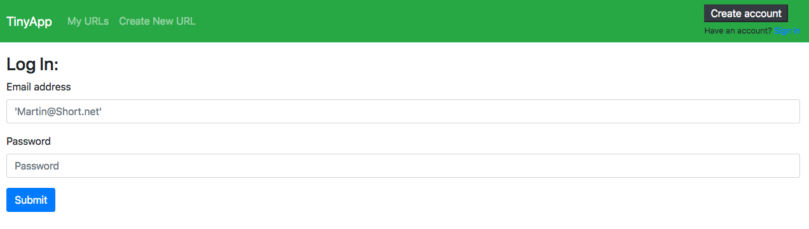

# TinyApp Project

### Written by Nicholas Meisenheimer (me!) as part of the LHL Web Dev Bootcap Curiculum

TinyApp is a full stack web application built with Node and Express that allows users to shorten long URLs (à la bit.ly).

Features include: adding, editing, deleting  short URLs; Multi-user capibilities with encrypted session-cookies and hashed passwords.

## Final Product
Login view includes dynamic messaging on error or redirect:

Register view includes dynamic messaging on error:

Index lists urls pertaining to the logged in user:

Logged in user can edit shortened url endpoint:

## Dependencies

- Node.js
- Express
- EJS
- bcrypt
- body-parser
- cookie-session

## Getting Started

- Install all dependencies (using the `npm install` command).
- Run the development web server using the `node express_server.js` command.